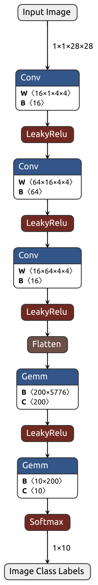
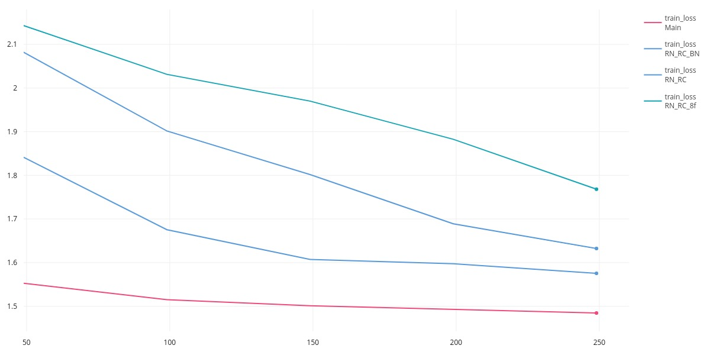
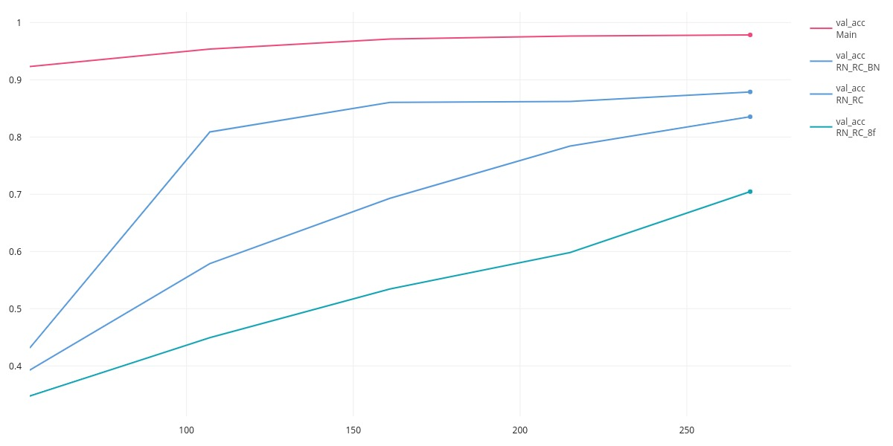

# SeminareCNN
> This repo is about the Seminar "Grundlagen des maschinellen Lernens 1 & 2" I did at the Karlsruhe Institute of Technology in the summer semester 2023 where I had the Topic "Convolutional Neural Networks".

## Description

My Topic was "Convolutional Neural Networks" and I had the task to write a Paper and present a Presentation about this topic.
This Repository contains all the material I used for both of them.

The trainings and inference Code for my self-trained CNN for digit recognition can be found [here](Proseminar_MNIST_CNN.ipynb) in form of jupyter file.
Addtionally you can download the model from [here](https://drive.google.com/file/d/15QUc0498NM50-KL3woxGr6elq82t3ePx/view?usp=sharing).

## Models

I trained four different model, below I will shortly descibe them:
- Main, the Baseline Standard Model.
- RN_RC, encoperates randomly cropping(RC) the images and adding random noise(RN)
- RN_RC_8f, uses 8filters instead of 16
- RN_RC_BN, addtionally adds batchnorm(BN)

You can find the Model checkpoints, in the respective folders.

### Architetcure of the Baseline Model



## Loading Model & Inference

```python
# We need one extra dimesnion to emulate batch size.
data = data.view(1, 1, 28, 28)

model = net.load_from_checkpoint(checkpoint_folder + "/1L_RN_RC-epoch=4.ckpt")
model.eval()

with torch.no_grad():
   y_hat = model(data.cuda())

print("Results for Inference")
print("---------------------------")
print(" ")
print("Probabilities for Predicted-Labels: ", y_hat)
print(" ")
print("Predicted Label: ", y_hat.argmax())
````

## Results

Cross-Entropy-Loss during training        |  Validation Accuracy on the test Set
:-------------------------:|:---------------------------------------------------:
  |  
