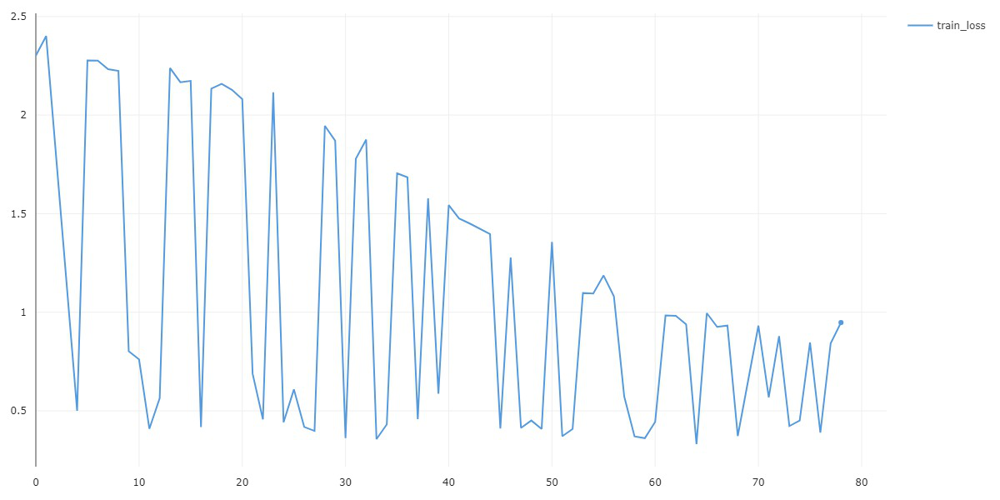
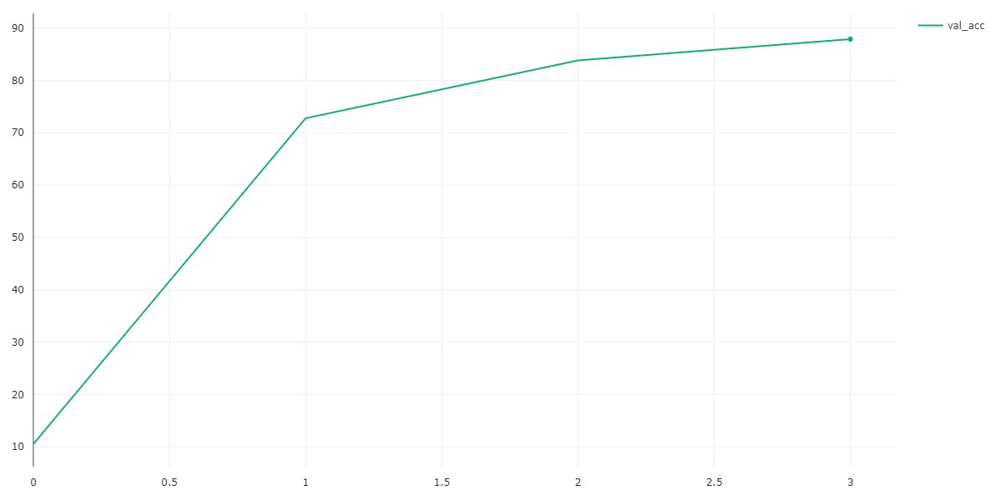

# SeminareCNN
> This repo is about the Seminar "Grundlagen des maschinellen Lernens 1 & 2" I did at the Karlsruhe Institute of Technology in the summer semester 2023 where I had the Topic "Convolutional Neural Networks".

## Description

My Topic was "Convolutional Neural Networks" and I had the task to write a Paper and present a Presentation about this topic.
This Repository contains all the material I used for both of them.

The trainings and inference Code for my self-trained CNN for digit recognition can be found [here](Proseminar_MNIST_CNN.ipynb) in form of jupyter file.
Addtionally you can download the model from [here](https://drive.google.com/file/d/15QUc0498NM50-KL3woxGr6elq82t3ePx/view?usp=sharing).

## Model Architetcure

```
Model(
  (hidden0): Sequential(
    (0): Conv2d(1, 16, kernel_size=(4, 4), stride=(1, 1))
    (1): LeakyReLU(negative_slope=0.2)
  )
  (hidden1): Sequential(
    (0): Conv2d(16, 64, kernel_size=(4, 4), stride=(1, 1))
    (1): LeakyReLU(negative_slope=0.2)
  )
  (hidden2): Sequential(
    (0): Conv2d(64, 16, kernel_size=(4, 4), stride=(1, 1))
    (1): LeakyReLU(negative_slope=0.2)
  )
  (hidden3): Sequential(
    (0): Linear(in_features=5776, out_features=1000, bias=True)
    (1): LeakyReLU(negative_slope=0.2)
  )
  (hidden4): Sequential(
    (0): Linear(in_features=1000, out_features=200, bias=True)
    (1): LeakyReLU(negative_slope=0.2)
  )
  (hidden5): Sequential(
    (0): Linear(in_features=200, out_features=10, bias=True)
  )
)
```

## Loading Model & Inference

```python
model = Model.load_from_checkpoint("CNN_MNIST_epoch=2-step=237.ckpt")
model.eval()

with torch.no_grad():
   y_hat = model(data.cuda())

print("Results for Inference")
print("---------------------------")
print(" ")
print("Probabilities for Predicted-Labels: ", y_hat)
print(" ")
print("Predicted Label: ", y_hat.argmax())
````

## Results

Cross-Entropy-Loss during training        |  Validation Accuracy on the test Set
:-------------------------:|:---------------------------------------------------:
  |  
