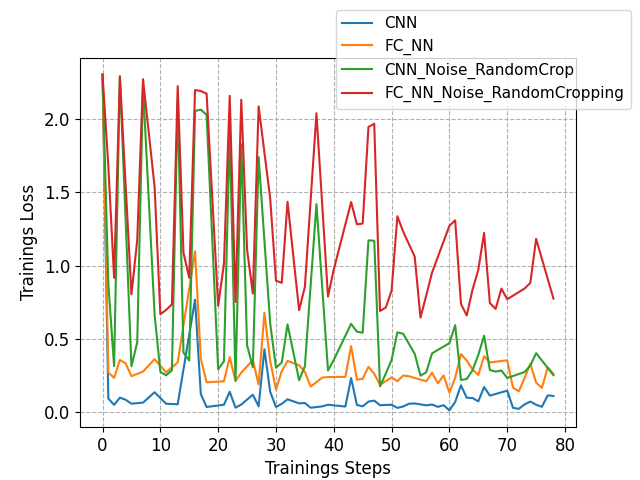
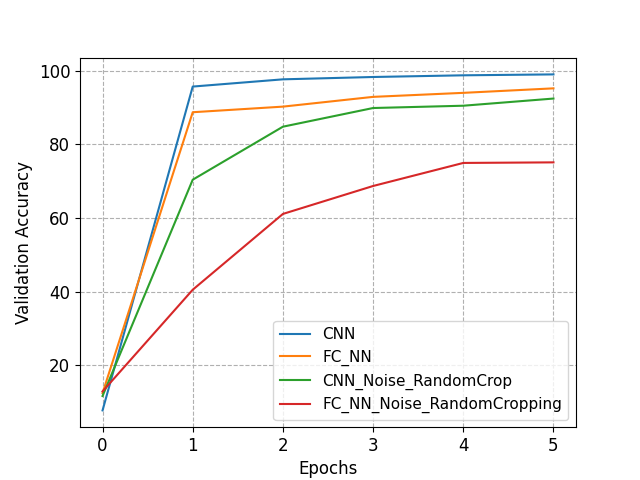

# SeminareCNN
> This repo is about the Seminar "Grundlagen des maschinellen Lernens 1 & 2" I did at the Karlsruhe Institute of Technology in the summer semester 2023 where I had the Topic "Convolutional Neural Networks".

## Description

My Topic was "Convolutional Neural Networks" and I had the task to write a Paper and present a Presentation about this topic.
This Repository contains all the material I used for both of them.

The trainings and inference Code for my self-trained CNN for digit recognition can be found in form of jupyter file.  

In the [Presentation Folder](Presentation) all files related to the presentation can be found.  
In the [Peport Folder](Report) all files related to the Report can be found.

## Models

I trained four different model, below I will shortly describe them:
- [CNN](CNN), the Baseline Standard Model based on a Convolutional Neural Network.
- [CNN_NOISE_RC](CNN_NOISE_RC), the Baseline model, but trained on altered data, where random noise and random cropping was used.
- [FC_NN](CNN_NOISE_RC), a model without convolutional layers using only fully connected layers, but having the same size as the CNN Model.
- [FC_NN_NOISE_RC](CNN_NOISE_RC), the fully connected model with random Noise and Random Cropping.

You can find the Model checkpoints and code, in the respective folders.  
The Architecture graphics in the architecture fodler were made with [Netron](https://github.com/lutzroeder/netron).

### Architecture of the Baseline Model

```
==========================================================================================
Layer (type:depth-idx)                   Output Shape              Param #
==========================================================================================
Model                                    [1, 10]                   --
├─Sequential: 1-1                        [1, 16, 25, 25]           --
│    └─Conv2d: 2-1                       [1, 16, 25, 25]           272
│    └─LeakyReLU: 2-2                    [1, 16, 25, 25]           --
├─Sequential: 1-2                        [1, 32, 11, 11]           --
│    └─Conv2d: 2-3                       [1, 32, 22, 22]           8,224
│    └─LeakyReLU: 2-4                    [1, 32, 22, 22]           --
│    └─MaxPool2d: 2-5                    [1, 32, 11, 11]           --
├─Sequential: 1-3                        [1, 64, 8, 8]             --
│    └─Conv2d: 2-6                       [1, 64, 8, 8]             32,832
│    └─LeakyReLU: 2-7                    [1, 64, 8, 8]             --
├─Sequential: 1-4                        [1, 512]                  --
│    └─Conv2d: 2-8                       [1, 128, 5, 5]            131,200
│    └─LeakyReLU: 2-9                    [1, 128, 5, 5]            --
│    └─MaxPool2d: 2-10                   [1, 128, 2, 2]            --
│    └─Flatten: 2-11                     [1, 512]                  --
├─Sequential: 1-5                        [1, 100]                  --
│    └─Linear: 2-12                      [1, 100]                  51,300
│    └─LeakyReLU: 2-13                   [1, 100]                  --
├─Sequential: 1-6                        [1, 10]                   --
│    └─Linear: 2-14                      [1, 10]                   1,010
│    └─LogSoftmax: 2-15                  [1, 10]                   --
==========================================================================================
Total params: 224,838
Trainable params: 224,838
Non-trainable params: 0
Total mult-adds (M): 9.58
==========================================================================================
````

### Architecture of the fully connected NN

```
==========================================================================================
Layer (type:depth-idx)                   Output Shape              Param #
==========================================================================================
Model                                    [1, 10]                   --
├─Sequential: 1-1                        [1, 250]                  --
│    └─Flatten: 2-1                      [1, 784]                  --
│    └─Linear: 2-2                       [1, 250]                  196,250
│    └─LeakyReLU: 2-3                    [1, 250]                  --
├─Sequential: 1-2                        [1, 100]                  --
│    └─Linear: 2-4                       [1, 100]                  25,100
│    └─LeakyReLU: 2-5                    [1, 100]                  --
├─Sequential: 1-3                        [1, 50]                   --
│    └─Linear: 2-6                       [1, 50]                   5,050
│    └─LeakyReLU: 2-7                    [1, 50]                   --
├─Sequential: 1-4                        [1, 10]                   --
│    └─Linear: 2-8                       [1, 10]                   510
│    └─LogSoftmax: 2-9                   [1, 10]                   --
==========================================================================================
Total params: 226,910
Trainable params: 226,910
Non-trainable params: 0
Total mult-adds (M): 0.23
==========================================================================================
```

## Loading Model & Inference

To load and use a Model check the `.ipynb` associated with the model.  
Basic usage:  

```python
# We need one extra dimesnion to emulate batch size.
data = data.view(1, 1, 28, 28)

model = net.load_from_checkpoint(checkpoint_folder + "/1L_RN_RC-epoch=4.ckpt")
model.eval()

with torch.no_grad():
   y_hat = model(data.cuda())

print("Results for Inference")
print("---------------------------")
print(" ")
print("Probabilities for Predicted-Labels: ", y_hat)
print(" ")
print("Predicted Label: ", y_hat.argmax())
````

## Results

Cross-Entropy-Loss during training        |  Validation Accuracy on the test Set
:-------------------------:|:---------------------------------------------------:
  |  
